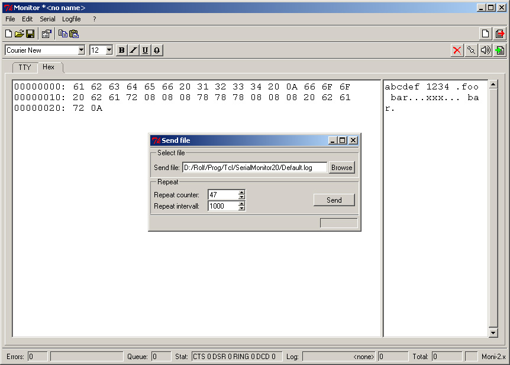

Rolf Schroedter is the original author of this application. I have uploaded it to github to preserve it and extend it.

This file is a recreation of the original webpage www.rolf-schroedter.de/moni which is no longer active.  
Archive is [here](https://web.archive.org/web/20170808215543/www.rolf-schroedter.de:80/moni)

# Moni: A serial port monitor written in Tcl/Tk

**Moni** is a raw serial port terminal program written in plain [Tcl/Tk](https://www.tcl-lang.org) running under Windows, Linux & Solaris.  
It requires Tcl8.4 or later (enhanced serial support).

**Moni** opens a connection to a serial port and displays incoming data in ASCII and/or Hexadecimal.  
It supports:
    * Serial configuration including handshake options
    * Sending of ASCII and hexadecimal charaters to the port
    * Send the contents of a file with repetition
    * Logging of all incoming data
    * Manual setting and monitoring of handshake lines (since Moni 2.20)

**Moni** uses the fantastic [BWidgets](https://core.tcl-lang.org/bwidget/home) toolkit.

Screenshot of the TTY (ASCII) display and serial port configuration:  

Screenshot of hexadecimal display and send file tool:  

Please feel free to use, redistribute and modify **Moni** for your own needs.

## Who is Moni

The program is dedicated to our sweet "Moni" (Aug 1995 - Aug 1999)  

